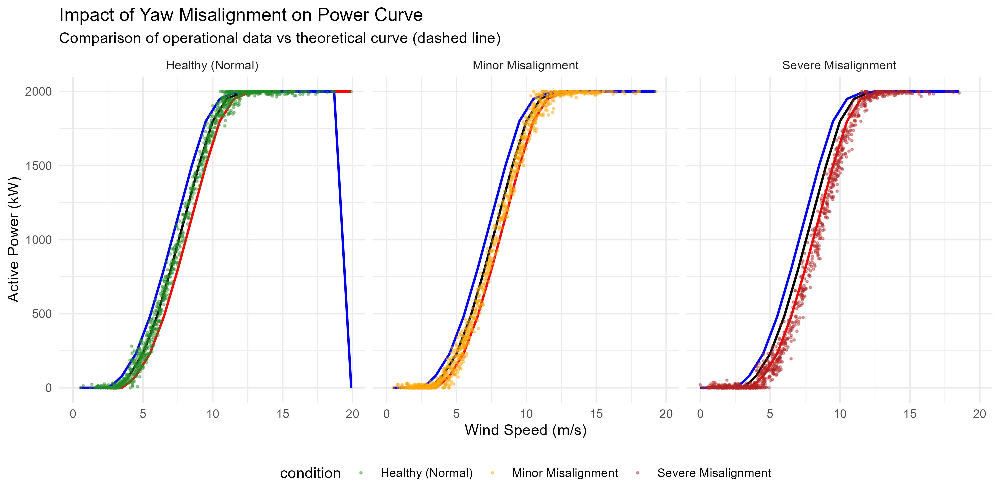

# 🌬️ Wind Turbine Yaw Misalignment Detection
### End-to-End Synthetic SCADA Simulation & Anomaly Detection Pipeline


**A data-driven framework to monitor wind turbine performance, simulate yaw misalignment faults, and prioritize O&M actions using Machine Learning.**

---

## 📋 Project Overview

This project implements a complete **End-to-End Pipeline** for detecting Yaw Misalignment and underperformance in wind turbines using synthetic SCADA data.

Detecting yaw misalignment (when the turbine is not pointing directly into the wind) is critical for maximizing energy production and reducing mechanical stress. This repository contains a physics-based simulation engine calibrated for a **Vestas V90 2MW turbine** that generates realistic operational data, injects stochastic faults, and trains an **XGBoost Classifier** to identify underperforming assets.

### 📉 Visualizing the Anomaly
The system automatically detects the characteristic "shift to the right" in the Power Curve caused by aerodynamic efficiency loss.


*Figure: Comparison of Healthy vs. Misaligned Turbines generated by the simulation engine.*

---

## 📂 Repository Structure

```text
wind-turbine-performance/
├── 01_data_generator.R          # Core Engine: Simulation, Feature Eng. & Model Training
├── 02_report_generator.Rmd      # Reporting: Generates the PDF for stakeholders
├── Wind_Turbine_Analysis_Report.pdf # Sample output report
├── power_curve_examples.png     # Visual assets
└── README.md                    # Project documentation
```


---
## 📬 Contact

This project was developed by **Juan Peñas Utrilla**.
If you have any questions about the methodology or would like to discuss Data Science:

[](https://www.linkedin.com/in/juan-peñas-utrilla-59b244311)

